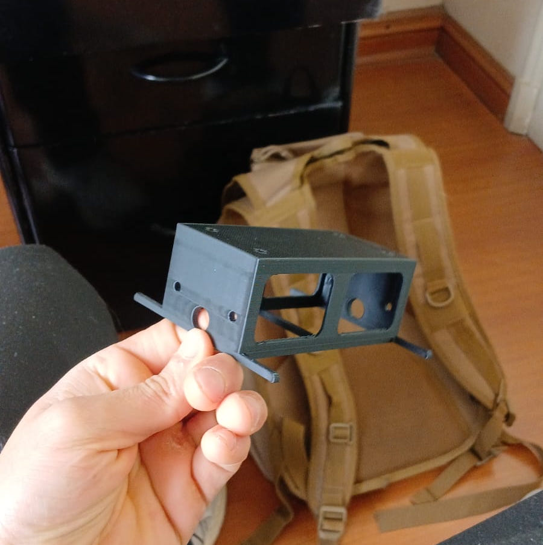

# Mecatrónica [4250] - Robot Auto-Balancín

## Objetivos

El objetivo principal de este proyecto es el diseño y la construcción de un robot autobalancín funcional. El núcleo del desafío consiste en la implementación de un controlador **PID (Proporcional-Integral-Derivativo)** para mantener el equilibrio dinámico del sistema.

Para lograr esto, se integrarán componentes mecatrónicos esenciales, utilizando un microcontrolador **Arduino UNO** como unidad central de procesamiento. Este gestionará la lógica de control programada en C++ y la comunicación entre los sensores (encargados de medir la inclinación) y los actuadores (motores DC seleccionados para las ruedas). Además, el proyecto incluye el diseño de una **estética original y atractiva**, como parte de los requerimientos.

Es importante definir el alcance: el foco está puesto en la **integración exitosa de los componentes** y en la **demostración de un sistema de autobalanceo funcional**, más que en la optimización de la eficiencia o el rendimiento del diseño. Por lo tanto, aunque el prototipo pueda presentar ciertas ineficiencias, el objetivo se centra en la aplicación práctica de los conceptos de control.

Todas las especificaciones y requerimientos de diseño se encuentran detallados en el documento [**base.pdf**](base.pdf).

## Avance 1 [22 de Septiembre]

La carpeta [**avance_1**](avance_1) corresponde a los avances iniciales relacionados con la primera presentación.

### Contenido del avance:
- **Prototipos iniciales**: Se desarrollaron dos prototipos, siendo el segundo el seleccionado para continuar el desarrollo. Próximamente se evaluarán mejoras adicionales según los requerimientos.




- **Código de movimiento**: Se incluye el programa para el control de movimiento de las ruedas, específicamente diseñado para los **motores DC** del prototipo final.

```cpp
#include <Stepper.h>
int stepsPerRevolution = 2048;
int motSpeed = 5;
// Pin al que está conectado el potenciómetro
const int PotPin = A0;

// Variable para almacenar el valor leído del potenciómetro
int PotVal;

Stepper myStepper(stepsPerRevolution, 8, 10, 9, 11);
Stepper myStepper2(stepsPerRevolution, 4, 6, 5, 7);

void setup() {
  myStepper.setSpeed(motSpeed);
  myStepper2.setSpeed(motSpeed);
}

void loop() {
  for (int i = 0; i < stepsPerRevolution; i++) {
    PotVal = analogRead(PotPin);
    if (PotVal <= 60){
      myStepper.step(-1);      // un paso motor 1
      myStepper2.step(1);     // un paso motor 2
    }
      else { 
        myStepper.step(1);      // un paso motor 1
        myStepper2.step(-1);     // un paso motor 2
    }
  }
}
```

### Observaciones y mejoras identificadas:
- **Material de las ruedas**: Implementar un material rugoso para mejorar la tracción
- **Refuerzos estructurales**: Añadir soportes en zonas críticas susceptibles a daños por impactos
- **Optimización del motor**: Utilizar el motorreductor amarillo por su ligereza y favorable relación torque/velocidad angular

## Presentación 2 [20 de Octubre]

La carpeta [**avance_2**](avance_2) corresponde a los avances para la segunda entrega del curso, donde se realizan varios cambios y avances, tanto en el diseño, como la incorporación de componentes y el código.

### Contenido del avance:

- **Cambio de Diseño:** Se realizó una revisión completa del diseño inicial, implementando mejoras sustanciales en la configuración mecánica y electrónica del sistema.

- **Sistema de Propulsión:** Se incorporaron motores DC con caja reductora ("motores amarillos"), seleccionados por su óptima relación torque-velocidad angular y mayor eficiencia energética para aplicaciones de balanceo.

- **Configuración Mecánica:**
  - Se implementó montaje con separadores para evitar interferencias con componentes soldados
  - Se adoptó diseño estructural abierto que minimiza uso de material, mejora ventilación y facilita acceso al cableado

- **Electrónica del Sistema:**
  - Control de motores mediante puente H L298N
  - Sensor de movimiento: Módulo GY-521 (MPU-6050)
  - Unidad de control: Arduino Uno
  - Alimentación: Banco de baterías de 12V CC

- **Ventajas del Nuevo Diseño:**
  - Mayor eficiencia energética
  - Mejor disipación térmica
  - Accesibilidad para mantenimiento
  - Optimización de peso y materiales
 
## Avance 3 [11 de Noviembre]
